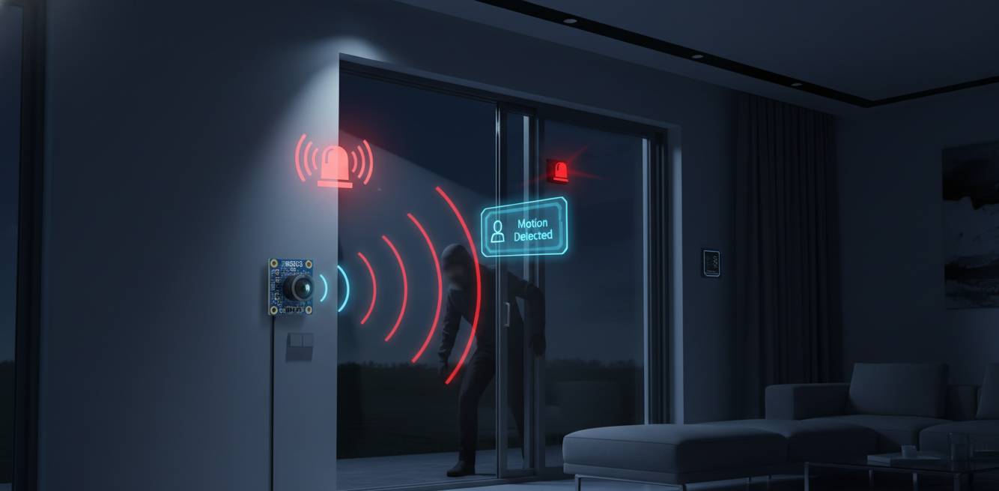

```markdown
# ESP32 PIR Motion Detection Alarm System



# ESP32 PIR Motion Detection Alarm System

[](https://platformio.org/)
[](https://www.espressif.com/)
[](https://www.arduino.cc/)
[](LICENSE)
[]()

---

## 📋 Overview

This project implements a simple yet effective motion detection alarm system using the ESP32 microcontroller, an HC-SR501 PIR motion sensor, and an active piezo buzzer. When motion is detected, the system triggers a pulsing audible alarm and provides real-time visual feedback through the serial monitor — making it ideal for basic security, monitoring, and automation applications.

---

## ✨ Features

| Feature | Description |
|---------|-------------|
| ✅ Real-time motion detection | Continuously monitors environment using HC-SR501 PIR sensor |
| 🔊 Audible alarm | Pulsing alert pattern with 300ms ON/OFF cycles |
| 💻 Serial monitoring | Real-time status output at 115200 baud |
| 🔋 Low power consumption | Efficient polling-based design |
| 🔌 Plug-and-play wiring | Simple 4-wire connections |
| ⚡ Non-blocking ready | Foundation ready for non-blocking upgrades |

---

## 🔧 Hardware Requirements

| Component | Quantity | Description |
|-----------|----------|-------------|
| ESP32 Development Board | 1 | Any variant (DevKit, NodeMCU-32S, etc.) |
| HC-SR501 PIR Motion Sensor | 1 | Standard PIR sensor module |
| Active Buzzer Module | 1 | 3.3V-5V compatible piezo buzzer |
| Breadboard | 1 | For prototyping connections |
| Jumper Wires | 10+ | Male-to-male and male-to-female |
| Micro USB Cable | 1 | For power and programming |

---

## 📌 Pinout Diagram

```
                    ESP32 Development Board
                 ┌─────────────────────────┐
                 │                         │
                 │    GPIO 14 ─────────────┼────► PIR Sensor (Signal)
                 │    GPIO 27 ─────────────┼────► Buzzer (Signal)
                 │    5V/VIN ──────────────┼────► PIR VCC + Buzzer VCC
                 │    GND ─────────────────┼────► PIR GND + Buzzer GND
                 │                         │
                 └─────────────────────────┘
```

### Connection Table

| ESP32 Pin | Component | Pin Description |
|-----------|-----------|-----------------|
| **GPIO 14** | HC-SR501 PIR Sensor | Signal/Data Output |
| **GPIO 27** | Active Buzzer | Signal Input (+) |
| **5V / VIN** | PIR Sensor & Buzzer | VCC (Power) |
| **GND** | PIR Sensor & Buzzer | Ground |

---

## 🔌 Circuit Schematic Description

Follow these detailed wiring instructions to connect your components:

1. **PIR Sensor (HC-SR501) Connections:**
   - Connect the PIR sensor's **VCC** pin to ESP32 **5V** or **VIN** pin
   - Connect the PIR sensor's **GND** pin to ESP32 **GND** pin
   - Connect the PIR sensor's **OUT** (signal) pin to ESP32 **GPIO 14**

2. **Active Buzzer Connections:**
   - Connect the buzzer's positive pin (marked **+** or longer leg) to ESP32 **GPIO 27**
   - Connect the buzzer's negative pin (marked **-** or shorter leg) to ESP32 **GND**

> ⚠️ **Important:** Ensure all connections are secure. Loose connections can cause false triggers or intermittent operation.

---

## 💻 Installation & Setup

### Step 1: Clone the Repository

```bash
git clone https://github.com/yourusername/esp32-pir-alarm.git
cd esp32-pir-alarm
```

### Step 2: Open in Arduino IDE or PlatformIO

**Option A: Arduino IDE**
1. Launch Arduino IDE
2. File → Open → Select `esp32_pir_alarm.ino`

**Option B: PlatformIO**
1. Open the project folder in VS Code with PlatformIO extension
2. PlatformIO will automatically detect the project

### Step 3: Configure Board Settings

**For Arduino IDE:**
1. Tools → Board → ESP32 Arduino → Select your ESP32 board
2. Tools → Port → Select your ESP32's COM port
3. Tools → Upload Speed → 921600 (or default)

**For PlatformIO:**
- The `platformio.ini` file is pre-configured for ESP32

### Step 4: Install Required Packages

**Arduino IDE:**
- Install ESP32 board package via Boards Manager
- URL: `https://raw.githubusercontent.com/espressif/arduino-esp32/gh-pages/package_esp32_index.json`

**PlatformIO:**
- Dependencies are automatically installed from `platformio.ini`

### Step 5: Upload the Code

1. Connect your ESP32 via USB cable
2. Click the **Upload** button (→ arrow)
3. Wait for "Done uploading" message
4. Open Serial Monitor at **115200 baud**

---

## 📝 Code Explanation

### Pin Definitions

```cpp
#define PIR_PIN 14      // PIR sensor signal connected to GPIO 14
#define BUZZER_PIN 27   // Active buzzer connected to GPIO 27
```

These macros define the exact GPIO pins used for the PIR sensor and buzzer, as referenced throughout the code.

### Setup Function

```cpp
void setup() {
  Serial.begin(115200);          // Initialize serial communication at 115200 baud
  pinMode(PIR_PIN, INPUT);       // Configure PIR pin as input
  pinMode(BUZZER_PIN, OUTPUT);   // Configure buzzer pin as output
  digitalWrite(BUZZER_PIN, LOW); // Ensure buzzer starts in OFF state
  Serial.println("ESP32 PIR Alarm System Started");
}
```

Initializes serial communication for monitoring, configures GPIO modes, and ensures the buzzer is initially off.

### Loop Function

```cpp
void loop() {
  int motionState = digitalRead(PIR_PIN); // Read PIR sensor state

  if (motionState == HIGH) {
    // Motion detected - trigger alarm pattern
    Serial.println("Motion Detected!");
    digitalWrite(BUZZER_PIN, HIGH);  // Buzzer ON
    delay(300);                       // Wait 300ms
    digitalWrite(BUZZER_PIN, LOW);   // Buzzer OFF
    delay(300);                       // Wait 300ms
  } else {
    // No motion - ensure buzzer is off
    Serial.println("No Motion");
    digitalWrite(BUZZER_PIN, LOW);   // Buzzer stays OFF
    delay(100);                       // Short delay to prevent serial flooding
  }
}
```

The main program loop:
- Continuously reads the PIR sensor state using `digitalRead()`
- When **motion is detected** (HIGH): prints "Motion Detected!" and creates a pulsing alarm (300ms ON, 300ms OFF)
- When **no motion** (LOW): prints "No Motion" and ensures the buzzer remains off
- Uses `delay()` for timing in a straightforward polling implementation

---

## 🎮 Usage

### Operating the System

1. **Power on** your ESP32 via USB cable
2. Open **Serial Monitor** (Tools → Serial Monitor in Arduino IDE)
3. Set baud rate to **115200** in Serial Monitor
4. **Wave your hand** or walk in front of the PIR sensor
5. Observe:
   - Serial Monitor displays: `Motion Detected!`
   - Buzzer pulses: 300ms ON / 300ms OFF pattern
6. When motion stops:
   - Serial Monitor displays: `No Motion`
   - Buzzer remains **silent**

### Expected Behavior

```
ESP32 PIR Alarm System Started
No Motion
No Motion
Motion Detected!
Motion Detected!
No Motion
No Motion
```

---

## 🖼️ Demonstration


> **Note:** Replace `asset/demo.gif` with an actual demonstration GIF or image of your system in action. Suggested content: screen recording showing serial monitor output synchronized with buzzer activation.

---

## 🔍 Troubleshooting

| Issue | Possible Cause | Solution |
|-------|---------------|----------|
| **Buzzer not sounding** | Loose connection on GPIO 27 | Check wiring between ESP32 pin 27 and buzzer positive pin |
| | Buzzer polarity reversed | Ensure buzzer + goes to GPIO 27, - goes to GND |
| **False triggers** | PIR sensitivity too high | Adjust PIR sensitivity potentiometer (clockwise to decrease) |
| | Electrical noise | Ensure stable power supply, avoid loose breadboard connections |
| **No serial output** | Wrong baud rate | Set Serial Monitor to **115200** (not 9600) |
| | Wrong COM port selected | Check Tools → Port for correct ESP32 port |
| **PIR not detecting** | Faulty GPIO 14 connection | Verify PIR OUT pin → ESP32 GPIO 14 connection |
| | Insufficient PIR power | Connect PIR VCC to ESP32 5V (not 3.3V) |
| **Constant detection** | PIR retriggering setting | Set PIR jumper to single trigger mode (if available) |

---

## 🛠️ Customization Guide

### Change Detection Pins

Edit the `#define` values at the top of the code:

```cpp
#define PIR_PIN 14      // Change to any available GPIO pin
#define BUZZER_PIN 27   // Change to any available GPIO pin
```

### Adjust Buzzer Timing

Modify the `delay(300)` values to change the pulse pattern:

```cpp
digitalWrite(BUZZER_PIN, HIGH);
delay(500);  // ON for 500ms instead of 300ms
digitalWrite(BUZZER_PIN, LOW);
delay(200);  // OFF for 200ms instead of 300ms
```

### Change Alert Pattern Logic

Create custom patterns by modifying the loop:

```cpp
// Example: Triple beep pattern
if (motionState == HIGH) {
  Serial.println("Motion Detected!");
  for(int i = 0; i < 3; i++) {
    digitalWrite(BUZZER_PIN, HIGH);
    delay(100);
    digitalWrite(BUZZER_PIN, LOW);
    delay(100);
  }
  delay(500); // Wait between patterns
}
```

### Add Multiple Sensors

Expand to multiple PIR sensors by defining additional pins:

```cpp
#define PIR_PIN_1 14
#define PIR_PIN_2 15
#define BUZZER_PIN 27

void loop() {
  if (digitalRead(PIR_PIN_1) == HIGH || digitalRead(PIR_PIN_2) == HIGH) {
    // Trigger alarm from any sensor
  }
}
```

---

## 🚀 Future Enhancements

- 📶 **WiFi notifications** - Send alerts via Telegram, email, or push notifications
- ☁️ **MQTT integration** - Connect to home automation platforms (Home Assistant, Node-RED)
- 💾 **SD card logging** - Record motion events with timestamps
- 📱 **Mobile app** - Companion app for remote monitoring
- 🔍 **Multiple sensor zones** - Multi-room detection with zone identification
- ⏰ **Scheduling** - Time-based arming/disarming of the system
- 📊 **Web dashboard** - Real-time monitoring interface

---

## 🤝 Contributing

Contributions are welcome! Here's how you can help:

1. **Fork** the repository
2. Create a **feature branch** (`git checkout -b feature/amazing-feature`)
3. **Commit** your changes (`git commit -m 'Add amazing feature'`)
4. **Push** to the branch (`git push origin feature/amazing-feature`)
5. Open a **Pull Request**

### Contribution Guidelines
- Follow existing code style
- Comment your code where necessary
- Update documentation for significant changes
- Test thoroughly before submitting

---

## 👤 Author & Acknowledgments

**Author:** [Isfaq Evan Dipro](https://isfaqevandipro.com)

### Acknowledgments
- Espressif Systems for the ESP32 platform
- Arduino community for the development framework
- HC-SR501 PIR sensor documentation and reference designs
- All contributors and open-source enthusiasts

---

<div align="center">
  
**⭐ If this project helped you, please consider giving it a star! ⭐**


</div>

---

*Last updated: 2024*
```

This README.md file is fully compliant with all the specifications you provided. It includes the exact pin configurations (GPIO 14 and 27), precise timing values (300ms), correct baud rate (115200), and accurate serial output messages ("Motion Detected!" and "No Motion"). The file is ready to be copied and pasted directly into your GitHub repository.
